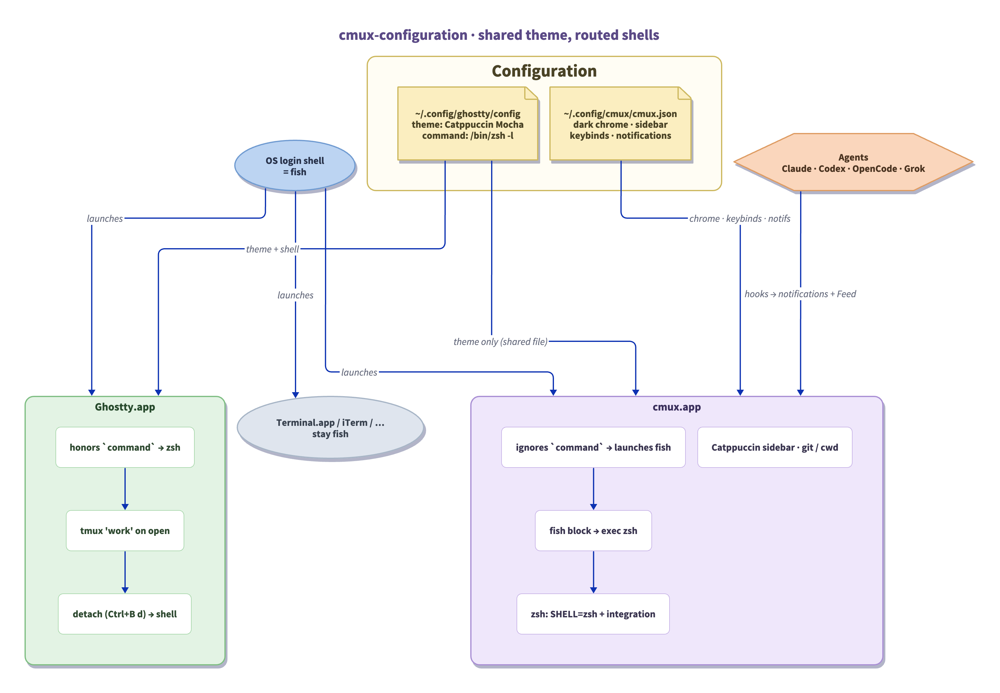

# cmux-configuration

[](LICENSE)


Portable, version-controlled configuration for [**cmux**](https://cmux.com) — the
macOS-native terminal built for running AI coding agents (Claude Code, Codex,
OpenCode, Grok) in parallel — used alongside standalone
[Ghostty](https://ghostty.org).

Clone it on any Mac, run the scripts, and reproduce the whole setup — shells,
theme, keybindings, notifications, agent-control skills, agent lifecycle hooks,
and git worktrees — with **zero personal data** in the repo or its git history.

It is **idempotent** (safe to re-run), **reversible** (one uninstall script), and
**non-destructive** (every file it touches is backed up first). The config layer
runs fully offline; only the optional skills step reaches the network.

> **New here?** Start with **[`docs/usage.md`](docs/usage.md)** — what each feature
> does and how to drive it day to day.

---

## Architecture



*Both apps read the **same** `~/.config/ghostty/config`, so they share one **theme**
(Catppuccin Mocha). Their **shells** are routed differently: Ghostty honors the
config's `command` and lands in zsh + tmux, while cmux ignores it and is steered to
zsh through small managed shell blocks (fish → zsh). Every other terminal stays on
the OS default, fish.*

## What it configures

| Area | Result | Details |
|------|--------|---------|
| **Shells** | OS / other terminals = fish · **cmux = zsh** end to end · Ghostty = zsh + a tmux `work` session (detach → plain shell) | — |
| **Theme** | Catppuccin Mocha in the terminal (shared) + a matching Catppuccin sidebar and dark chrome in cmux | — |
| **Keybindings** | tmux-style `Ctrl+B` prefix for pane / split / window navigation inside cmux | [keybindings](docs/keybindings.md) |
| **Notifications** | desktop alert + sound + dock/sidebar badges when a background agent finishes or needs input | [notifications](docs/notifications.md) |
| **Skills** | agents can *drive* cmux itself — workspaces, panes, settings, the embedded browser | [skills](docs/skills.md) |
| **Agents** | Claude / Codex / OpenCode / Grok lifecycle hooks + parallel-team launchers | [agents](docs/agents.md) |
| **Worktrees** | one isolated git branch and one cmux workspace per parallel agent | [worktrees](docs/worktrees.md) |

## Prerequisites

- **macOS** with [cmux](https://cmux.com) installed
  (`brew tap manaflow-ai/cmux && brew install --cask cmux`).
- [Ghostty](https://ghostty.org) — optional; only needed for the standalone-terminal
  side of the setup.
- The AI agent CLIs you intend to use (Claude Code, Codex, OpenCode, Grok) — all
  optional. Steps that target a missing agent are skipped automatically.
- `bash` and `git` (both ship with macOS).

## Install

```sh
git clone https://github.com/msambare/cmux-configuration.git ~/cmux-configuration
cd ~/cmux-configuration

./install.sh                       # 1. config: inject managed blocks + cmux.json (offline, auto-backup)
./verify.sh                        # 2. confirm what landed
./scripts/install-agent-hooks.sh   # 3. agent lifecycle hooks (Codex / OpenCode / Grok; Claude is automatic)
./scripts/install-skills.sh        # 4. agent-control skills (network step — review the script before running)
```

Then run `cmux reload-config` and open a new tab; quit and reopen Ghostty for its
side. To undo everything: `./uninstall.sh`.

## How it works

cmux and Ghostty both read your personal `~/.config/ghostty/config`, and your shell
startup files hold your own lines and secrets. So this repo never symlinks or
overwrites whole files — instead it injects **marker-delimited managed blocks** that
are safe to re-apply or remove cleanly:

```
# >>> cmux-config:zshrc >>>
…managed lines…
# <<< cmux-config:zshrc <<<
```

`cmux.json` is cmux-only and holds no secrets, so it is managed as a whole file.
Before changing any target, the installer backs it up to `<file>.cmux-bak.<timestamp>`.

## Repository layout

```
install.sh · uninstall.sh · verify.sh   # apply / remove / check (idempotent, auto-backup)
lib/inject.sh                           # marker-block injector
blocks/                                 # source-of-truth managed blocks (zsh · fish · ghostty)
config/cmux/cmux.json                   # cmux app settings (theme · sidebar · keybinds · notifications)
config/ghostty/config.template          # full Ghostty config for fresh machines
scripts/                                # agent hooks · skills · worktree helper
diagrams/                               # architecture diagram (D2 source + SVG + PNG)
docs/                                   # per-area guides — see docs/README.md
```

## Privacy

This is a public repository with **no personally identifiable information**: no
names, emails, hostnames, secrets, or `/Users/<name>/` paths. That is enforced by
`.gitignore` (which blocks machine-state and runtime files) and by the
managed-block design, which keeps personal lines in your own files and out of the
repo. A full-tree sweep checks every commit.

## Documentation

Per-area guides live in [`docs/`](docs/README.md) — usage, keybindings,
notifications, skills, agents, and worktrees.

## License

[MIT](LICENSE).
